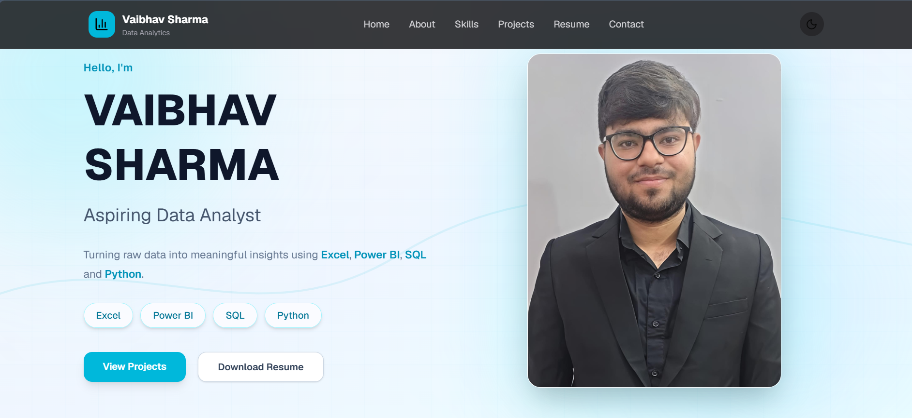
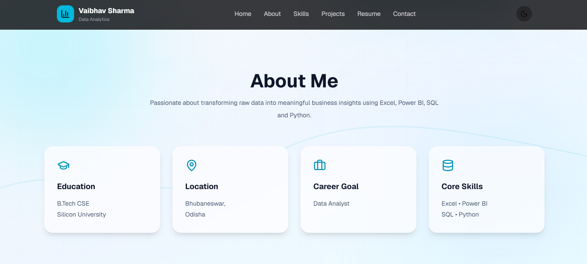
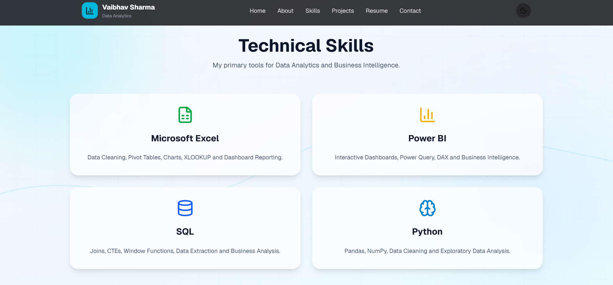
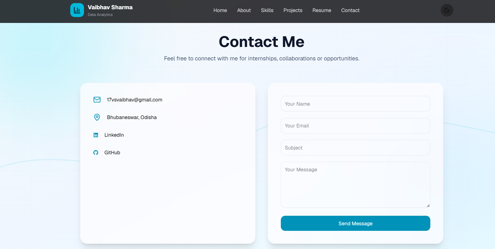
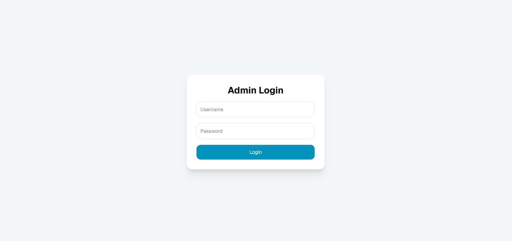
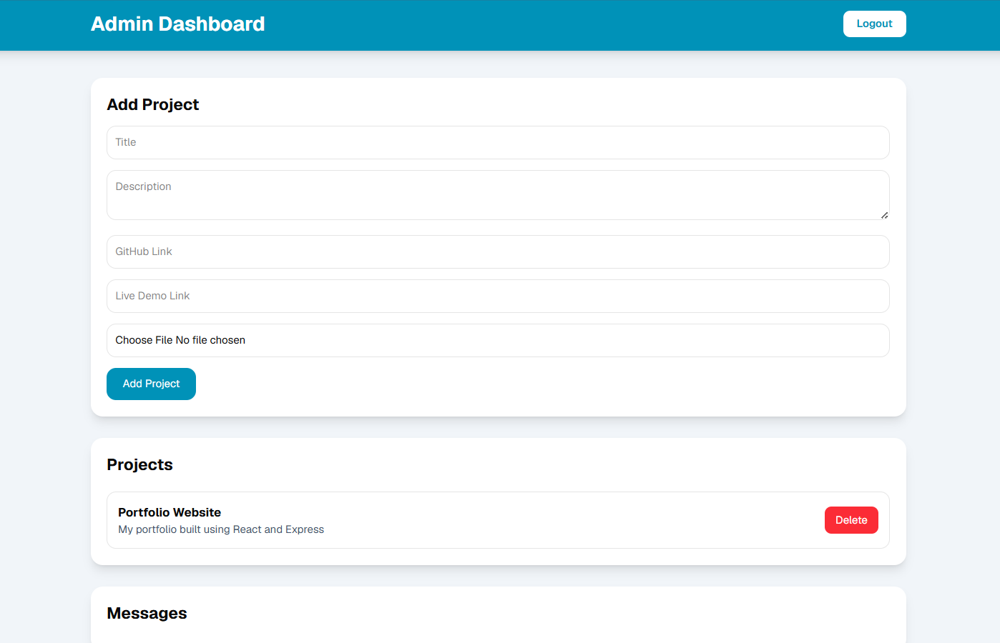

<div align="center">

# 📊 Data Analytics Portfolio

### Modern Full Stack Portfolio Website for Data Analytics Professionals

<p>
A fully responsive portfolio platform built with <b>React</b>, <b>Express.js</b>, <b>Node.js</b>, and <b>MySQL</b> featuring a secure Admin Dashboard for managing portfolio content, projects, and visitor messages.
</p>

<br>

<a href="https://data-analytics-portfolio-alpha.vercel.app">

</a>

<a href="https://github.com/VaibhavSharma0917/data-analytics-portfolio">

</a>

<br><br>


</div>

---

# ✨ About The Project

Unlike a traditional static portfolio, this application is built as a **complete Full Stack Portfolio Management System**.

It allows visitors to explore my profile, technical skills, projects, and resume while providing a secure admin panel that enables portfolio management without modifying the frontend source code.

The project demonstrates modern full-stack development practices including authentication, REST APIs, database integration, cloud deployment, and responsive UI design.

---

# 📸 Project Preview

> Replace these placeholders with your screenshots.

| Home |
|------|
|  |

| About | Skills |
|--------|--------|
|  |  |

| Contact | Login |
|----------|-------|
|  |  |

| Admin Dashboard |
|----------------|
|  |

---

# 🚀 Highlights

<table>

<tr>

<td width="50%">

### 🌐 Portfolio Experience

- Modern Landing Page
- Responsive Layout
- About Me Section
- Technical Skills
- Featured Projects
- Resume Download
- Contact Form
- Professional UI

</td>

<td width="50%">

### 🔐 Admin Dashboard

- JWT Authentication
- Protected Routes
- Add Projects
- Delete Projects
- Upload Project Images
- Manage Contact Messages
- Secure Backend APIs

</td>

</tr>

</table>

---

# 🛠 Technology Stack

| Category | Technologies |
|-----------|--------------|
| Frontend | React, Vite, Tailwind CSS, Axios, React Router |
| Backend | Node.js, Express.js, JWT Authentication, Multer |
| Database | MySQL (Railway) |
| Deployment | Vercel, Render, Railway |

---

# 🏗 System Architecture

```text
                Visitor
                   │
                   ▼
      React Frontend (Vercel)
                   │
            REST API Requests
                   │
                   ▼
      Express Backend (Render)
                   │
           MySQL Queries
                   │
                   ▼
        Railway MySQL Database
```

---

# 📂 Project Structure

```text
Data-Analytics-Portfolio
│
├── src
│   ├── components
│   ├── pages
│   ├── lib
│   ├── App.jsx
│   └── main.jsx
│
├── Backend
│   ├── config
│   ├── controllers
│   ├── middleware
│   ├── routes
│   ├── uploads
│   └── server.js
│
├── public
├── screenshots
└── README.md
```

---

# 📬 Connect With Me

<div align="center">

### Vaibhav Sharma

📧 **17vsvaibhav@gmail.com**

🌐 **Portfolio**  
https://data-analytics-portfolio-alpha.vercel.app

💼 **LinkedIn**  
https://www.linkedin.com/in/vaibhav-sharma-84352b310

💻 **GitHub**  
https://github.com/VaibhavSharma0917

</div>

---

<div align="center">

### ⭐ If you found this project interesting, consider giving it a star.

**Designed & Developed by Vaibhav Sharma .**

</div>
